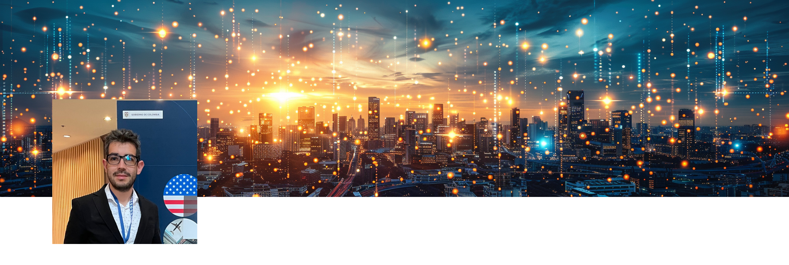

>*Whether you think you can or you think you can’t, you’re right - Henry Ford*

During the last decade I have had the pleasure to witness how the technology has been transforming the life of millions of people. The good news is that it will continue to happen, we now have the technology to solve complex problems it all start by `imagine` how can we make better.

# The Convergence Point; my point of view on DeepTech and Entrepreneurship

DeepTech represents the frontier of innovation, rooted in profound scientific and engineering breakthroughs. From AI to biotechnology, these technologies have the potential to address some of the world’s most pressing challenges. Entrepreneurship in the DeepTech sector is about more than just business; it’s about leveraging these cutting-edge advancements to create solutions that can drive societal progress and sustainable growth. By focusing on the convergence of technology, society, and business, we can harness the power of DeepTech to build a better future. This intersection is where true innovation happens, providing opportunities to not only advance industries but also to make a meaningful impact on the world. Embracing this convergence point is crucial for leading in an ever-evolving landscape, where technology and entrepreneurship work hand in hand to solve complex problems and create lasting value.

> Innovation often looks like the tiny stand in the corner of a tradeshow

I share insights from a variety of angles—courses, personal thoughts, experiments, and entrepreneurial ventures. Each note is designed to offer a holistic understanding of key DeepTech categories. Through detailed course summaries, reflective thoughts, documented experiments, and entrepreneurial experiences, these notes provide a comprehensive view of how these technologies are advancing and the innovative opportunities they present. Join me in exploring the transformative potential of DeepTech.

# Latest Notes

* [Creating an Personalized E-Learning Platform with AI](./notes/courses/generative-ai-beginners.md)

# Categories

* [Artificial Intelligence (AI) and Machine Learning (ML)](./notes/ai/),
* Biotechnology and Life Sciences,
* Advanced Materials,
* Quantum Computing,
* Robotics and Automation,
* Internet of Things (IoT),
* Space Technology,
* Energy and Environmental Technology,
* Blockchain and Distributed Ledger Technology,
* Neuroscience and Neurotechnology.

 

