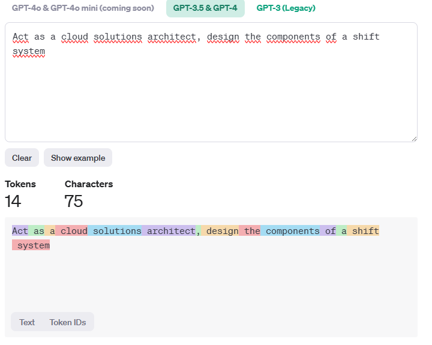

## AI Model
An **AI model** is a mathematical representation that learns patterns from data and makes predictions or decisions:

1. **Training Data**:
   - An AI model is trained using a large dataset. For example, to build a model that recognizes cats in images, you'd need a dataset of cat images labeled as "cat."
   - The model learns from this data by adjusting its internal parameters (weights and biases) to minimize prediction errors.

2. **Architecture**:
   - The architecture defines how the model is structured. Common architectures include neural networks (like deep learning models) and decision trees.
   - Neural networks consist of layers of interconnected nodes (neurons). Each layer processes input data and passes it to the next layer.

3. **Learning Algorithms**:
   - The model uses learning algorithms (such as gradient descent) to optimize its parameters during training.
   - These algorithms adjust weights based on the difference between predicted outputs and actual labels.

4. **Inference**:
   - After training, the model can make predictions on new, unseen data (inference).
   - For instance, given an image, the cat recognition model predicts whether it contains a cat.

5. **Generalization**:
   - A good AI model generalizes well—it performs accurately on unseen examples.
   - Overfitting (when a model memorizes training data) is undesirable, as it hurts generalization.

6. **Evaluation**:
   - Models are evaluated using metrics like accuracy, precision, recall, or F1-score.
   - The goal is to create a model that performs well on real-world tasks.

## Foundation Models
Foundation models are self-trained models that serve as a base for fine-tuning the models we use.

> A foundation model is any model that is trained on broad data (generally using self-supervision at scale) that can be adapted (e.g., fine-tuned) to a wide range of downstream tasks; current examples include BERT [Devlin et al. 2019], GPT-3 [Brown et al. 2020], and CLIP [Radford et al. 2021]. From a technological point of view, foundation models are not new — they are based on deep neural networks and self-supervised learning, both of which have existed for decades. However, the sheer scale and scope of foundation models from the last few years have stretched our imagination of what is possible; for example, GPT-3 has 175 billion parameters and can be adapted via natural language prompts to do a passable job on a wide range of tasks despite not being trained explicitly to do many of those tasks [Brown et al. 2020]. At the same time, existing foundation models have the potential to accentuate harms, and their characteristics are in general poorly understood. Given their impending widespread deployment, they have become a topic of intense scrutiny [Bender et al. 2021].
> [On the Opportunities and Risks of Foundation Models](https://arxiv.org/abs/2108.07258?WT.mc_id=academic-105485-koreyst), 
> [Foundation Models Hierarchy](https://github.com/microsoft/generative-ai-for-beginners/blob/main/02-exploring-and-comparing-different-llms/README.md?WT.mc_id=academic-105485-koreyst#foundation-models-versus-llms)

# Tokenization
Tokenization involves translating a series of words into numeric form called **tokens**, so the inference model can predict the next token; by repeating this process the output is created and translated back to text for the user.

## Tokenization strategies
1. **Space-Based Tokenization**:
   - In many languages, words are separated by spaces. For example, in English, the sentence "Chatbots are helpful" can be tokenized into individual words: ["Chatbots", "are", "helpful"].
   - However, languages like Chinese or Japanese don't use spaces to separate words. In such cases, tokenization uses techniques like character-level segmentation or statistical models to find the most probable word boundaries.

2. **Character-Level Tokenization**:
   - Instead of breaking text into words, character-level tokenization dissects it into individual characters. For example, the English sentence "Chatbots are helpful" would be tokenized as: ["C", "h", "a", "t", "b", "o", "t", "s", " ", "a", "r", "e", " ", "h", "e", "l", "p", "f", "u", "l"].
   - This approach is especially useful for languages without explicit word separators or for specific NLP tasks¹.

3. **Language-Agnostic Techniques**:
   - Some tokenization methods are designed to be language-agnostic. They iteratively merge frequent sequences of characters or subwords in a given corpus, regardless of the language².
   - These techniques allow models to process and understand text by converting it into a sequence of meaningful tokens, capturing nuances like grammar, syntax, and semantics³.

Given those techniques and language native particularities, there is a substancial difference when tokenizing the same sentence on different languages, for instance the following comparision between Tokenizing the same text in Spanish and English, to do so I'm using the [OpenAI Tokenizer](https://platform.openai.com/tokenizer)

* [What is Tokenization? Types, Use Cases, Implementation.](https://www.datacamp.com/blog/what-is-tokenization)
* [How tokenizing text, sentence, words works - GeeksforGeeks](https://www.geeksforgeeks.org/nlp-how-tokenizing-text-sentence-words-works/)
* [Tokenization Unveiled: How AI Understands Human Language](https://blog.seancoughlin.me/understanding-tokenization-in-large-language-models)
* [I pretrained 16 language models from scratch with different ... - Reddit](https://www.reddit.com/r/MachineLearning/comments/168wc1o/i_pretrained_16_language_models_from_scratch_with/)

# Model Classification
There are a lot of models in the market there 
### License
* OpenSource Models
* Propietary Models
### Ouput
* Embeddings (They transform the text into numerical useful to search)
* TTS Translate output to audio
* Image Generation
* Text or Code Generation
### Architecture
* Encoder (These models are good at understanding the input and finding a relation with the context).
* Decoder (These models are good at generating ouputs based on the context).
* Encoder / Decoder (Think on having a *Encoder Model* feeding the *Decoder model*).
> If you are somehow familiar with Control Theory thinking on Opening / Closing Loops with the models.

* [OpenAI embeddings models](https://platform.openai.com/docs/models/embeddings)
* [Hugginface Models] (https://huggingface.co/models)
* [Github Models] (https://github.blog/news-insights/product-news/introducing-github-models/)
  
## Deploying and Improving LLM results
***Azure AI Studio*** includes a enriched catalog of models we can use to create our platform, with such variety selecting the best model is a mix of deploy, experiment, measure, making Azure AI Studio a great tool to fast deploy an iterate.
[How to deploy on Azure AI Studio](https://github.com/microsoft/generative-ai-for-beginners/blob/main/02-exploring-and-comparing-different-llms/README.md?WT.mc_id=academic-105485-koreyst#how-to-test-and-iterate-with-different-models-to-understand-performance-on-azure)

Deployment Options:

Img taken from the course, original source: [Four Ways that Enterprises Deploy LLMs](https://www.fiddler.ai/blog/four-ways-that-enterprises-deploy-llms)