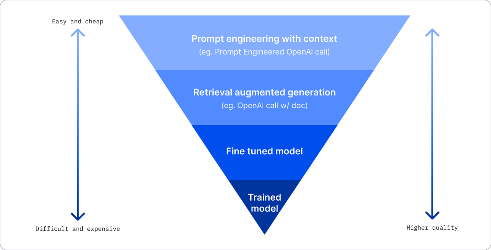

## Foundation Models
Foundation models are self-trained models that serve as a base for fine-tuning the models we use.

> A foundation model is any model that is trained on broad data (generally using self-supervision at scale) that can be adapted (e.g., fine-tuned) to a wide range of downstream tasks; current examples include BERT [Devlin et al. 2019], GPT-3 [Brown et al. 2020], and CLIP [Radford et al. 2021]. From a technological point of view, foundation models are not new — they are based on deep neural networks and self-supervised learning, both of which have existed for decades. However, the sheer scale and scope of foundation models from the last few years have stretched our imagination of what is possible; for example, GPT-3 has 175 billion parameters and can be adapted via natural language prompts to do a passable job on a wide range of tasks despite not being trained explicitly to do many of those tasks [Brown et al. 2020]. At the same time, existing foundation models have the potential to accentuate harms, and their characteristics are in general poorly understood. Given their impending widespread deployment, they have become a topic of intense scrutiny [Bender et al. 2021].
> [On the Opportunities and Risks of Foundation Models](https://arxiv.org/abs/2108.07258?WT.mc_id=academic-105485-koreyst),
> [Foundation Models](https://github.com/microsoft/generative-ai-for-beginners/blob/main/02-exploring-and-comparing-different-llms/README.md?WT.mc_id=academic-105485-koreyst#foundation-models-versus-llms)

# Tokenization
Tokenization involves translating a series of words into numeric form, making it easier for the model to learn and work since it is a statistical model.

# Model Classification
Models can be classified by their ***license, Output, Architecture,*** and ***Commercial Offering:***
### License
#### OpenSource Models
* Alpaca
* Bloom
* LLaMA.

#### Propietary Models
* OpenAI models
* Google Gemini
* Claude 2.

### Ouput
#### Embeddings
They transform the text into numerical form 
* [OpenAI embeddings models](https://platform.openai.com/docs/models/embeddings)

#### Image Generation
Image generation models
* DALL-E
* Stable Diffusion

#### Text or Code Generation
* BookCorpus
* CodeParrot

### Architecture
Models can be classified as Encoder, Decoder or Both.

#### Encoder
These models are good at understanding the input and finding a relation with the context.
* BERT

#### Decoder
These models are good at generating ouputs based on the context.
* GPT

#### Encoder / Decoder
Think on having a *Encoder Model* feeding the *Decoder model*.
* BART
* T5
> If you are somehow familiar with Control Theory thinking on Open / Close Loops with the models.

### Commercial Offering

#### Service
Often offered by a *Cloud Service Provider* their offering includes a set of of models, data, and other components.
* Azure Open AI

#### Models
Isolated models either as an OpenSource you can use, allowing companies to run locally, however, may require equipment, build structure to scale and model specific licensing
* LLama  

## Deploying and Improving LLM results
***Azure AI Studio*** includes a enriched catalog of models we can use to create our platform, with such variety selecting the best model is a mix of deploy, experiment, measure, making Azure AI Studio a great tool to fast deploy an iterate.
[How to deploy on Azure AI Studio](https://github.com/microsoft/generative-ai-for-beginners/blob/main/02-exploring-and-comparing-different-llms/README.md?WT.mc_id=academic-105485-koreyst#how-to-test-and-iterate-with-different-models-to-understand-performance-on-azure)

Deployment Options:

Img taken from the course, original source: [Four Ways that Enterprises Deploy LLMs](https://www.fiddler.ai/blog/four-ways-that-enterprises-deploy-llms)