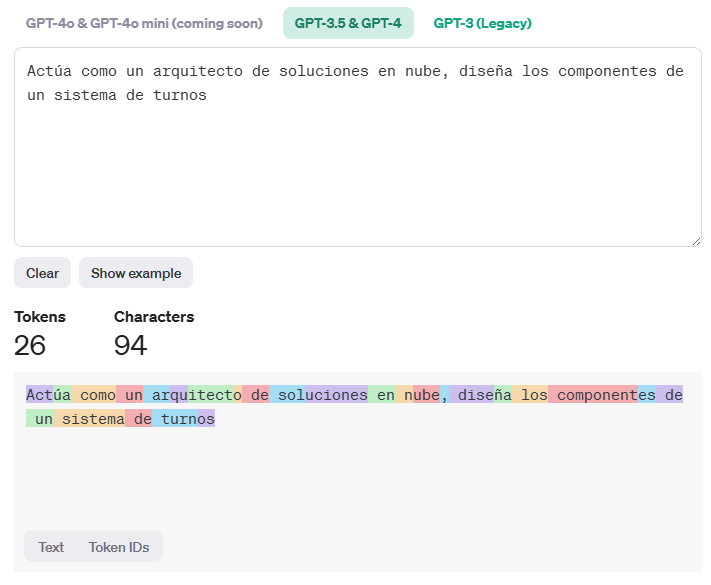

# AI Model
An AI model,  is a structured representation of algorithms and data designed to perform tasks that typically necessitate human intelligence. These tasks encompass a wide spectrum, including pattern recognition, decision-making, language understanding, and predictive analytics. AI models are foundational elements in various machine learning and deep learning systems.

**Core Components**

* **Algorithms:** Algorithms are the procedural steps and mathematical formulas that underpin an AI model. These can range from simple linear regression to complex neural networks with multiple hidden layers. The choice of algorithm significantly impacts the model's capability to learn and generalize from data.

* **Training Data:** Training data consists of labeled or unlabeled datasets that are fed into the model to facilitate learning. The quality and quantity of this data are critical, as they directly influence the model's accuracy and performance. Data preprocessing steps such as normalization, augmentation, and feature extraction are often employed to enhance the dataset's utility.

* **Training Process:** The training phase involves iterative optimization of the model's parameters to minimize a predefined loss function. Techniques such as gradient descent are commonly used to update weights in neural networks. The training process may employ regularization methods like dropout or L2 regularization to prevent overfitting.

* **Inference:** Inference is the process of applying the trained model to new, unseen data to generate predictions or decisions. This phase requires efficient implementation to ensure low latency and high throughput, particularly in real-time applications.

## Foundation Models
Foundation models are self-trained models that serve as a base for fine-tuning the models we use, for instance the [Instruction Tuned Models](#instruction-tuned-models) I will write further.

> A foundation model is any model that is trained on broad data (generally using self-supervision at scale) that can be adapted (e.g., fine-tuned) to a wide range of downstream tasks; current examples include BERT [Devlin et al. 2019], GPT-3 [Brown et al. 2020], and CLIP [Radford et al. 2021]. From a technological point of view, foundation models are not new — they are based on deep neural networks and self-supervised learning, both of which have existed for decades. However, the sheer scale and scope of foundation models from the last few years have stretched our imagination of what is possible; for example, GPT-3 has 175 billion parameters and can be adapted via natural language prompts to do a passable job on a wide range of tasks despite not being trained explicitly to do many of those tasks [Brown et al. 2020]. At the same time, existing foundation models have the potential to accentuate harms, and their characteristics are in general poorly understood. Given their impending widespread deployment, they have become a topic of intense scrutiny [Bender et al. 2021].
> [On the Opportunities and Risks of Foundation Models](https://arxiv.org/abs/2108.07258?WT.mc_id=academic-105485-koreyst), 
> [Foundation Models Hierarchy](https://github.com/microsoft/generative-ai-for-beginners/blob/main/02-exploring-and-comparing-different-llms/README.md?WT.mc_id=academic-105485-koreyst#foundation-models-versus-llms)

## Instruction Tuned Models
They have become very common with the OpenAI's Create your own GPT feature.
An ***Instruction Tuned Model*** is a ***Foundation Model*** which has been fine-tuned to do to follow detailed instructions provided by users. These models are designed to interpret, understand, and respond to a variety of explicit directives.

One of the most interesting 

* [An Introduction to “Base” and “Instruction Tuned” Large Language Models](https://blog.gopenai.com/an-introduction-to-base-and-instruction-tuned-large-language-models-8de102c785a6)

# Tokenization
Tokenization involves translating a series of words into numeric form called **tokens**, so the inference model can predict the next token; by repeating this process the output is created and translated back to text for the user.

## Tokenization strategies
1. **Space-Based Tokenization**:
   - In many languages, words are separated by spaces. For example, in English, the sentence "Chatbots are helpful" can be tokenized into individual words: ["Chatbots", "are", "helpful"].
   - However, languages like Chinese or Japanese don't use spaces to separate words. In such cases, tokenization uses techniques like character-level segmentation or statistical models to find the most probable word boundaries.

2. **Character-Level Tokenization**:
   - Instead of breaking text into words, character-level tokenization dissects it into individual characters. For example, the English sentence "Chatbots are helpful" would be tokenized as: ["C", "h", "a", "t", "b", "o", "t", "s", " ", "a", "r", "e", " ", "h", "e", "l", "p", "f", "u", "l"].
   - This approach is especially useful for languages without explicit word separators or for specific NLP tasks¹.

3. **Language-Agnostic Techniques**:
   - Some tokenization methods are designed to be language-agnostic. They iteratively merge frequent sequences of characters or subwords in a given corpus, regardless of the language².
   - These techniques allow models to process and understand text by converting it into a sequence of meaningful tokens, capturing nuances like grammar, syntax, and semantics³.

Given those techniques and language native particularities, there is a substancial difference when tokenizing the same sentence on different languages, for instance the following comparision between Tokenizing the same text in Spanish and English, to do so I'm using the [OpenAI Tokenizer](https://platform.openai.com/tokenizer)

* [What is Tokenization? Types, Use Cases, Implementation.](https://www.datacamp.com/blog/what-is-tokenization)
* [How tokenizing text, sentence, words works - GeeksforGeeks](https://www.geeksforgeeks.org/nlp-how-tokenizing-text-sentence-words-works/)
* [Tokenization Unveiled: How AI Understands Human Language](https://blog.seancoughlin.me/understanding-tokenization-in-large-language-models)
* [I pretrained 16 language models from scratch with different ... - Reddit](https://www.reddit.com/r/MachineLearning/comments/168wc1o/i_pretrained_16_language_models_from_scratch_with/)

# Model Classification
There are a lot of models in the market there 
### License
* **OpenSource Models:** They disclose fully or partially their source-code or training datasets, they may also be free to use.
* **Propietary Models:** The source code or training datasets are private they usually charge a fee for licensing
### Training
* **Supervised Learning Models:** These models are trained on labeled datasets where each input corresponds to a known output.
* **Unsupervised Learning Models:** Operating on unlabeled data, these models identify inherent structures and patterns.
* **Reinforcement Learning Models:** These models learn by interacting with an environment, receiving feedback in the form of rewards or penalties [Instruction Tuned Models](#instruction-tuned-models).
* **Deep Learging Models:** These models leverage multi-layered neural networks to capture high-level abstractions in data. Architectures like recurrent neural networks (RNNs) and generative adversarial networks (GANs) are notable examples.
### Ouput
* **Embeddings:** These transform the text into numerical useful to search by indexing information in documents
* **Audio Generation:** These models create audio from a text they can even use a human voice to replicate.
* **Image and Viceo Generation:** These models can create an image or a video based on a single prompt.
* **Text or Code Generation:** These models can create text or code based on a prompt.
* **3D Generation:** These models can create a 3D object from a prompt.
### Architecture
* **Encoder:** These models are good at understanding the input and finding a relation with the context.
* **Decoder:** These models are good at generating ouputs based on the context.
* **Encoder:** / Decoder (Think on having a *Encoder Model* feeding the *Decoder model*).
> If you are somehow familiar with Control Theory thinking on Opening / Closing Loops with the models.

* [OpenAI embeddings models](https://platform.openai.com/docs/models/embeddings)
* [Hugginface Models](https://huggingface.co/models)
* [Github Models](https://github.blog/news-insights/product-news/introducing-github-models/)
  
## Deploying and Improving LLM results
***Azure AI Studio*** includes a enriched catalog of models we can use to create our platform, with such variety selecting the best model is a mix of deploy, experiment, measure, making Azure AI Studio a great tool to fast deploy an iterate.
[How to deploy on Azure AI Studio](https://github.com/microsoft/generative-ai-for-beginners/blob/main/02-exploring-and-comparing-different-llms/README.md?WT.mc_id=academic-105485-koreyst#how-to-test-and-iterate-with-different-models-to-understand-performance-on-azure)

Deployment Options:

Img taken from the course, original source: [Four Ways that Enterprises Deploy LLMs](https://www.fiddler.ai/blog/four-ways-that-enterprises-deploy-llms)