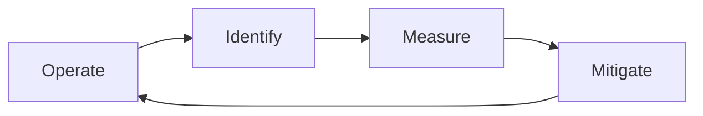

# Introduction to Gen-AI
It's important to note that artificial intelligence (AI) is a broader concept that has been around since the 1956. Currently, we are exploring Generative AI, which is the result of years of research and breakthroughs. Modern AI approaches are non-deterministic, working by translating text into a series of tokens and then predicting the next possible token in a sequence using statistics and a randomness factor known as temperature.

# Using Gen AI responsibly
> Everything we commit to must be taken with responsability looking for a greater benefit.

`LLMs will halluciate` that's a fact and we cannot avoid but we can take responsible approaches to avoid harmful or biased content to be generated.

# Mitigation Layers

>- **Model**. Choosing the right model for the right use case. Larger and more complex models like GPT-4 can cause more of a risk of harmful content when applied to smaller and more specific use cases. Using your training data to fine-tune also reduces the risk of harmful content.
>- **Safety System**. A safety system is a set of tools and configurations on the platform serving the model that help mitigate harm. An example of this is the content filtering system on the Azure OpenAI service. Systems should also detect jailbreak attacks and unwanted activity like requests from bots.
>- **Metaprompt**. Metaprompts and grounding are ways we can direct or limit the model based on certain behaviors and information. This could be using system inputs to define certain limits of the model. In addition, providing outputs that are more relevant to the scope or domain of the system.
It can also be using techniques like Retrieval Augmented Generation (RAG) to have the model only pull information from a selection of trusted sources. There is a lesson later in this course for [building search applications](../08-building-search-applications/README.md?WT.mc_id=academic-105485-koreyst)
>- **User Experience**. The final layer is where the user interacts directly with the model through our application’s interface in some way. In this way we can design the UI/UX to limit the user on the types of inputs they can send to the model as well as text or images displayed to the user. When deploying the AI application, we also must be transparent about what our Generative AI application can and can’t do.
>- **Evaluate model**. Working with LLMs can be challenging because we don’t always have control over the data the model was trained on. Regardless, we should always evaluate the model’s performance and outputs. It’s still important to measure the model’s accuracy, similarity, groundedness, and relevance of the output. This helps provide transparency and trust to stakeholders and users.

* [Azure AI Content Safety](https://learn.microsoft.com/azure/ai-services/content-safety/overview) can help detect harmful content and images via an API request.
* [Generative AI for Beginners Version 2 - Lesson 03](https://github.com/microsoft/generative-ai-for-beginners/tree/main/03-using-generative-ai-responsibly)
# Where to Go
- [Basics](./basics)
- [Experiments](./experiments)
- [Resources](./resources)
